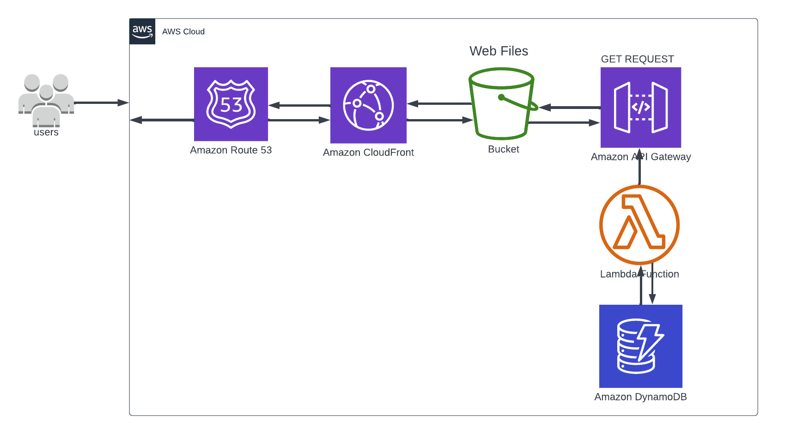

# Cloud-Resume

## This is a serverless based architecture with;

- S3 to store the webfiles and terraform state file
- Route53 to host DNS for domain name mapped to S3 URL
- CloudFront to serve content faster
- AWS Lambda code written in python to update DynamoDB with visitor count
- API gateway used to invoke lambda and fetch visitor count from DB
- CI/CD for frontend to deploy changes to S3 and invalidate cloudfront cache
- CI/CD for backend to run bash script that deploys lambda function using the AWS CLI
- Terraform as Iac used to create S3 bucket, DynamoDB table, Lambda, and API Gateway

Website URL: https://www.ayodele.cloud

Blogpost:  https://blog.ayodele.cloud
